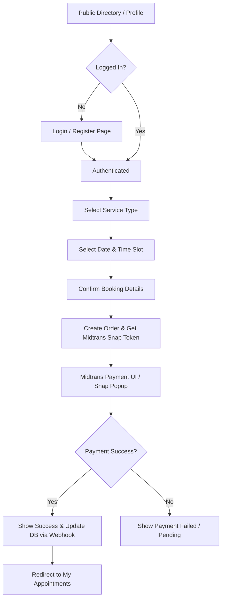
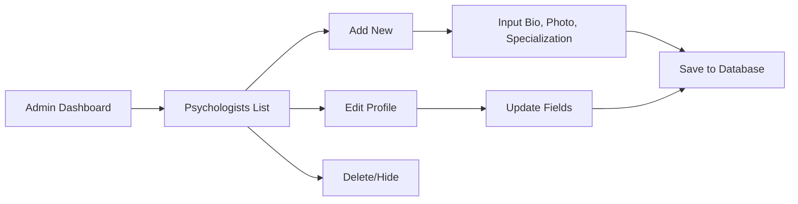
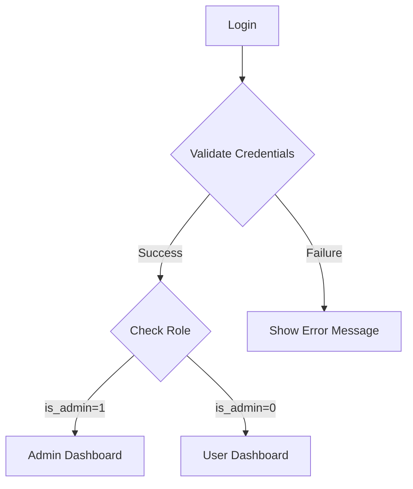

# Ruang Rasa Project Flows

This document outlines the sitemap, user roles, and core process flows for the **Ruang Rasa** psychology platform.

## 1. Roles & Permissions

| Role | Access Level | Description |
| :--- | :--- | :--- |
| **Guest** | Public | Can browse landing pages, articles, and psychologist directory. |
| **User (Patient)** | Authenticated | Can book appointments, manage their own sessions, and view personal dashboard. |
| **Admin** | Authenticated | Full control over psychologists (CRUD), view all appointments, and system management. |

---

## 2. Sitemap

### Public Pages
- **Home**: Banner, feature highlights, and Psychologist carousel.
- **About**: Company vision and mission.
- **Services**: Description of available therapy/counseling services.
- **Psychologist Directory**: List of all psychologists with search/filter.
  - **Psychologist Profile**: Detailed view with bio, specialties, and "Book Now" button.
- **Articles**: Blog/News list.
  - **Article Detail**: Full article content.
- **FAQ**: Common questions.
- **Contact**: Map and contact form.
- **Auth**:
  - **Login**: Email/Password authentication.
  - **Register**: New user account creation.

### User Portal (Logged In)
- **Dashboard**: Overview of upcoming appointments and recent notifications.
- **Booking Flow**:
  - **Step 1: Service Selection**
  - **Step 2: Psychologist & Schedule Selection**
  - **Step 3: Payment/Details**
  - **Step 4: Confirmation**
- **My Appointments**: History and status of bookings.
- **Profile Settings**: Personal info and password management.

### Admin Portal (Admin Role)
- **Admin Dashboard**: Analytics (Total appointments, most booked psychologists).
- **Manage Appointments**: List of all bookings with status updates (Confirm/Cancel).
- **Manage Psychologists (CRUD)**:
  - Add new Psychologist.
  - Edit existing profile information.
  - Remove/Deactivate Psychologists.
- **User Management**: View and manage patient records.

---

## 3. User Flows

### A. Booking Flow (Patient with Midtrans)

### B. Psychologist Management Flow (Admin)

### C. Authentication & Role Gateway

---

## 4. Task Plan (Feature Backlog)

- [ ] **Auth System**: Configure guards and roles (Admin vs User middleware).
- [ ] **Psychologist CRUD**: Build the admin interface for managing psychologist data.
- [ ] **Database Schema**:
  - `psychologists` table
  - `appointments` table
  - `orders` table (for Midtrans transaction tracking)
- [ ] **Booking Engine**: Implement the logic to link Users, Psychologists, and Time Slots.
- [ ] **Midtrans Integration**:
  - [ ] Set up `MIDTRANS_CLIENT_KEY` and `MIDTRANS_SERVER_KEY`.
  - [ ] Implement Snap Token generation in Backend.
  - [ ] Implement Frontend Snap JS integration.
  - [ ] Implement Webhook (Notification) handler to update status.
- [ ] **Dashboard Views**: Create responsive dashboards for both roles.
